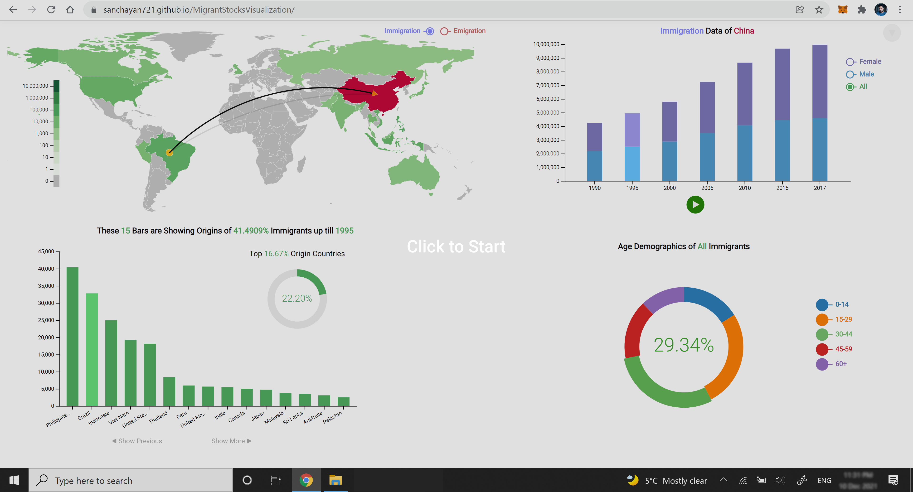

# Population Migration Data Visualization
This [application](https://sanchayan721.github.io/MigrantStocksVisualization/) is built to visualize migration of people from <code>1990</code> to <code>2017</code> and built with <code>d3.js</code>. Please open the appplication and interact with every element of the application to enjoy and consume the data. The best viewing experience can be achieved with a 4k monitor.

# Here is a Demo of the Application

